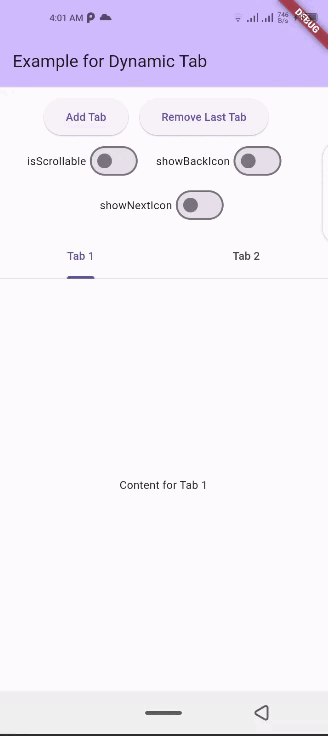
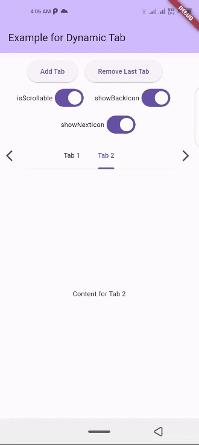
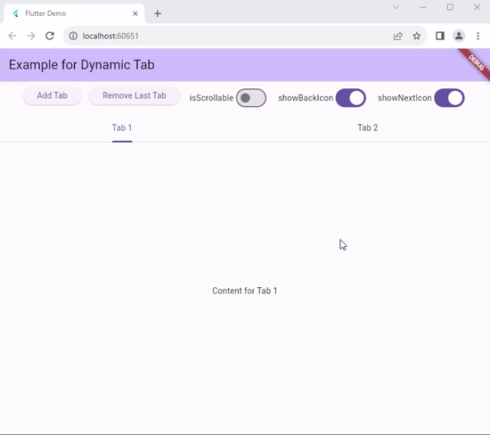
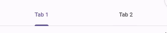
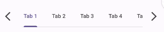
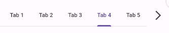
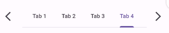
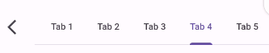
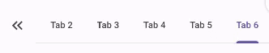
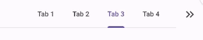

# dynamic_tab

A Flutter package that simplifies the implementation of dynamic TabBar in your application.

With `DynamicTabWidget`, users can effortlessly manage and navigate through a list of [Tabs](https://api.flutter.dev/flutter/material/TabBar-class.html). The widget is designed to auto-update as <b>Tabs</b> are added or removed, providing a seamless and dynamic user experience.

## Screenshots

<p float="left">
  
  
  
</p>

## Installation

1. Add dependency to ```pubspec.yaml``` file:</br>
Get the latest version from the 'Installing' tab on [pub.dev](https://pub.dev/packages/dynamic_tab/install)

```dart
dependencies:
  dynamic_tab: ^1.0.0
```

2. Import the package

```dart
import 'package:dynamic_tab/dynamic_tab.dart';
```

3. Adding CreditCardWidget

*With required parameters*

```dart
 DynamicTabWidget(
    dynamicTabs: tabs,
);
```

*With optional parameters*

```dart
 DynamicTabWidget(
    dynamicTabs: tabs,
    isScrollable: isScrollable,
    onTabControllerUpdated: (controller) {},
    onTabChanged: (index) {},
    onAddTabMoveTo: MoveToTab.LAST,
    backIcon: Icon(Icons.arrow_back),
    nextIcon: Icon(Icons.arrow_forward),
    showBackIcon: showBackIcon,
    showNextIcon: showNextIcon,

    // Default Tab properties can also be updated
    padding: padding,
    indicatorColor: indicatorColor,
    automaticIndicatorColorAdjustment: automaticIndicatorColorAdjustment,
    indicatorWeight: indicatorWeight,
    indicatorPadding: indicatorPadding,
    indicator: indicator,
    indicatorSize: indicatorSize,
    dividerColor: dividerColor,
    dividerHeight: dividerHeight,
    labelColor: labelColor,
    labelStyle: labelStyle,
    labelPadding: labelPadding,
    unselectedLabelColor: unselectedLabelColor,
    unselectedLabelStyle: unselectedLabelStyle,
    dragStartBehavior: dragStartBehavior,
    overlayColor: overlayColor,
    mouseCursor: mouseCursor,
    enableFeedback: enableFeedback,
    onTap: onTap,
    physics: physics,
    splashFactory: splashFactory,
    splashBorderRadius: splashBorderRadius,
    tabAlignment: tabAlignment,
);

```

## Features

- <b>Dynamic Tab Management</b>: Users can push or pop items in the ```List<TabData> tabs``` array, and the <b>DynamicTabWidget</b> will auto-update accordingly.

- <b>Tab Navigation</b>: Implement the ```onTabChanged``` callback to handle tab change events.

- <b>Customization Options</b>: Customize the appearance and behavior of the DynamicTabWidget using parameters like ```backIcon, nextIcon, showBackIcon, and showNextIcon```.

- <b>Tab Position</b> : Specify the position to which cursor moves to after adding new Tab using the ```onAddTabMoveTo``` property.

### Parameters

- <b>dynamicTabs</b>: List of TabData objects representing the dynamic tabs.

- <b>isScrollable</b>: Set to true to enable scrollable tabs.

- <b>onTabChanged</b>: Callback function triggered when a tab is changed.

- <b>onAddTabMoveTo</b>: Enum value (MoveToTab.FIRST, MoveToTab.LAST, MoveToTab.CURRENT) specifying where a new tab should be added.

- <b>backIcon</b>: Custom icon for the "Back" button, If ```isScrollable``` is false, this property is ignored.

- <b>nextIcon</b>: Custom icon for the "Next" button.

- <b>showBackIcon</b>: Boolean to show or hide the ```Back icon``` button, If ```isScrollable``` is false, this property is ignored.

- <b>showNextIcon</b>: Boolean to show or hide the ```Next icon``` button, If ```isScrollable``` is false, this property is ignored.

## How to use

### isScrollable

`isScrollable: false`  | `isScrollable: true`
-- | --
  |  

### showBackIcon

If ```isScrollable``` is false, this property is ignored.

`showBackIcon: false`  | `showBackIcon: true`
-- | --
  | 

### showNextIcon

If ```isScrollable``` is false, this property is ignored.

`showNextIcon: false`  | `showNextIcon: true`
-- | --
  | 

### backIcon

We can use custom Icon for back button, If ```isScrollable``` is false, this property is ignored.

`backIcon: Icon()`  | `backIcon: null`
-- | --
`Icon(Icons.keyboard_double_arrow_left)`  | Default back icon will be used
  | 

### nextIcon

We can use custom Icon for next button, If ```isScrollable``` is false, this property is ignored.

`nextIcon: Icon()`  | `nextIcon: null`
-- | --
`Icon(Icons.keyboard_double_arrow_right)`  | Default back icon will be used
  | 

## Example

Check out the **example** app in the [example](example) directory for a complete example.

```dart
import 'package:flutter/material.dart';
import 'package:dynamic_tab/dynamic_tab.dart';


class DynamicTabExample extends StatefulWidget {
  const DynamicTabExample({super.key});
  @override
  State<DynamicTabExample> createState() => _DynamicTabExampleState();
}

class _DynamicTabExampleState extends State<DynamicTabExample> {
  bool isScrollable = false;
  bool showNextIcon = true;
  bool showBackIcon = true;

  List<TabData> tabs = [
    TabData(
      index: 1,
      title: const Tab(
        child: Text('Tab 1'),
      ),
      content: const Center(child: Text('Content for Tab 1')),
    ),
    TabData(
      index: 2,
      title: const Tab(
        child: Text('Tab 2'),
      ),
      content: const Center(child: Text('Content for Tab 2')),
    ),
    // Add more tabs as needed
  ];


  @override
  Widget build(BuildContext context) {
    return Scaffold(
      appBar: AppBar(
        title: Text('Example for Dynamic Tab'),
      ),
      body: Column(
        mainAxisSize: MainAxisSize.min,
        children: <Widget>[
          Padding(
            padding: const EdgeInsets.all(8.0),
            child: Wrap(
              direction: Axis.horizontal,
              alignment: WrapAlignment.center,
              children: [
                ElevatedButton(
                  onPressed: addTab,
                  child: const Text('Add Tab'),
                ),
                const SizedBox(width: 12),
                ElevatedButton(
                  onPressed: () => removeTab(tabs.length - 1),
                  child: const Text('Remove Last Tab'),
                ),
                const SizedBox(width: 16),
                Row(
                  mainAxisSize: MainAxisSize.min,
                  children: [
                    const Text('isScrollable'),
                    Switch.adaptive(
                      value: isScrollable,
                      onChanged: (bool val) {
                        setState(() {
                          isScrollable = !isScrollable;
                        });
                      },
                    ),
                  ],
                ),
                const SizedBox(width: 16),
                Row(
                  mainAxisSize: MainAxisSize.min,
                  children: [
                    const Text('showBackIcon'),
                    Switch.adaptive(
                      value: showBackIcon,
                      onChanged: (bool val) {
                        setState(() {
                          showBackIcon = !showBackIcon;
                        });
                      },
                    ),
                  ],
                ),
                const SizedBox(width: 16),
                Row(
                  mainAxisSize: MainAxisSize.min,
                  children: [
                    const Text('showNextIcon'),
                    Switch.adaptive(
                      value: showNextIcon,
                      onChanged: (bool val) {
                        setState(() {
                          showNextIcon = !showNextIcon;
                        });
                      },
                    ),
                  ],
                ),
              ],
            ),
          ),
          Expanded(
            child: DynamicTabWidget(
              dynamicTabs: tabs,
              isScrollable: isScrollable,
              onTabControllerUpdated: (controller) {},
              onTabChanged: (index) {},
              onAddTabMoveTo: MoveToTab.LAST,
              showBackIcon: showBackIcon,
              showNextIcon: showNextIcon,
            ),
          ),
        ],
      ),
    );
  }

  void addTab() {
    setState(() {
      var tabNumber = tabs.length + 1;
      tabs.add(
        TabData(
          index: tabNumber,
          title: Tab(
            child: Text('Tab $tabNumber'),
          ),
          content: Column(
            mainAxisAlignment: MainAxisAlignment.center,
            children: [
              Text('Dynamic Tab $tabNumber'),
              const SizedBox(height: 20),
              ElevatedButton(
                onPressed: () => removeTab(tabNumber - 1),
                child: const Text('Remove this Tab'),
              ),
            ],
          ),
        ),
      );
    });
  }

  void removeTab(int id) {
    setState(() {
      tabs.removeAt(id);
    });
  }
}

```

## Contribution

Of course the project is open source, and you can contribute to it [repository link](https://github.com/alihaider78222/dynamic_tab)

- If you **found a bug**, open an issue.

- If you **have a feature request**, open an issue.

- If you **want to contribute**, submit a pull request.

## License

This project is licensed under the MIT License - see the [LICENSE](https://choosealicense.com/licenses/mit/) file for details.

## Conclusion

I will be happy to answer any questions that you may have on this approach, If you liked this package, don't forget to smash the ⭐.